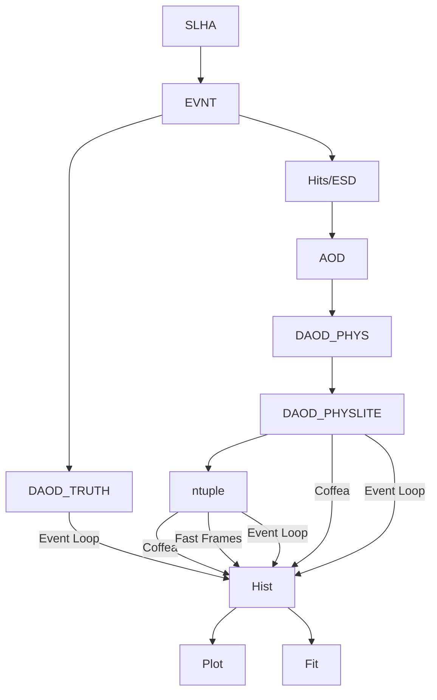

```mermaid
flowchart TD
    SLHA --> EVNT
    EVNT --> DAOD_TRUTH
    DAOD_TRUTH --Event Loop--> Hist
    EVNT--> Hits/ESD
    Hits/ESD --> AOD
    AOD --> DAOD_PHYS
    DAOD_PHYS --> DAOD_PHYSLITE
    ntuple --Coffea--> Hist
    ntuple --Fast Frames--> Hist
    ntuple --Event Loop--> Hist
    DAOD_PHYSLITE --Coffea--> Hist
    DAOD_PHYSLITE --> ntuple
    DAOD_PHYSLITE --Event Loop--> Hist
    Hist --> Plot
    Hist --> Fit
```
