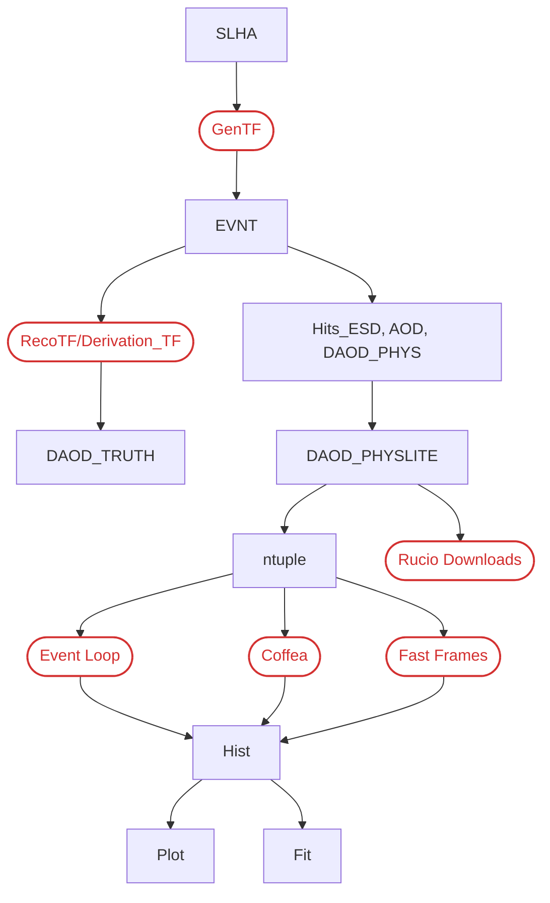

**Legend:**

- **🔴 Red border** — Benchmarking script
- **Blue node** — Data files

```mermaid
flowchart TD
    SLHA --> GenTF
    GenTF --> EVNT
    EVNT --> RecoTF/Derivation_TF
    RecoTF/Derivation_TF --> DAOD_TRUTH
    Event_Loop --> Hist

    EVNT--> bash["Hits_ESD, AOD, DAOD_PHYS"]
    bash["Hits_ESD, AOD, DAOD_PHYS"] --> DAOD_PHYSLITE

    ntuple --> Coffea
    Coffea --> Hist

    ntuple --> Fast_Frames
    Fast_Frames --> Hist

    ntuple --> Event_Loop
    DAOD_PHYSLITE --> ntuple
    DAOD_PHYSLITE --> Rucio_Downloads

    Hist --> Plot
    Hist --> Fit

    click Event_Loop "https://github.com/usatlas/AF-Benchmarking/tree/main/event_loop" "Event Loop documentation"
    click Coffea "https://github.com/usatlas/AF-Benchmarking/tree/main/NTuple_Hist/coffea" "Coffea documentation"
    click Fast_Frames "https://github.com/usatlas/AF-Benchmarking/tree/main/NTuple_Hist/fastframes" "Fast Frames documentation"
    click Rucio_Downloads "https://github.com/usatlas/AF-Benchmarking/blob/main/Rucio/rucio_script.sh" "'Rucio Downloads' Script"
    click GenTF "https://github.com/usatlas/AF-Benchmarking/tree/main/EVNT" "EVNT Job Scripts"
    click RecoTF/Derivation_TF "https://github.com/usatlas/AF-Benchmarking/tree/main/TRUTH3" "TRUTH3 Job Scripts"

    Event_Loop(["Event Loop"])
    Coffea(["Coffea"])
    Fast_Frames(["Fast Frames"])
    Rucio_Downloads(["Rucio Downloads"])
    GenTF(["GenTF"])
    RecoTF/Derivation_TF(["RecoTF/Derivation_TF"])
    
    classDef method fill:transparent,stroke:#d32f2f,stroke-width:2px,color:#d32f2f;
    class Event_Loop,Coffea,Fast_Frames,Rucio_Downloads,GenTF,RecoTF/Derivation_TF method;

```

