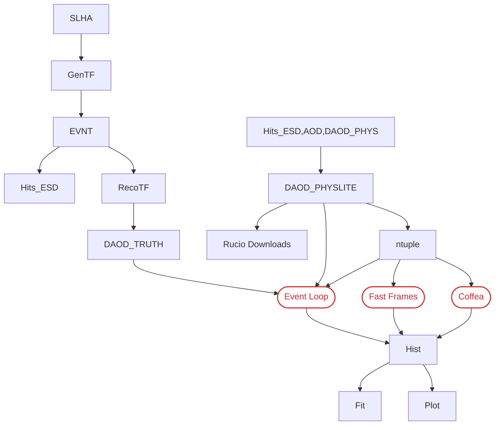

```mermaid
flowchart TD
    SLHA --> GenTF
    GenTF --> EVNT
    EVNT --> RecoTF
    RecoTF --> DAOD_TRUTH
    DAOD_TRUTH --> Event_Loop
    Event_Loop --> Hist

    EVNT--> Hits_ESD
    Hits_ESD,AOD,DAOD_PHYS --> DAOD_PHYSLITE

    ntuple --> Coffea
    Coffea --> Hist

    ntuple --> Fast_Frames
    Fast_Frames --> Hist

    ntuple --> Event_Loop
    DAOD_PHYSLITE --> ntuple
    DAOD_PHYSLITE --> Event_Loop
    DAOD_PHYSLITE --> bash[Rucio Downloads]

    Hist --> Plot
    Hist --> Fit

    click Event_Loop "https://github.com/usatlas/AF-Benchmarking/tree/main/event_loop" "Event Loop documentation"
    click Coffea "https://github.com/usatlas/AF-Benchmarking/tree/main/NTuple_Hist/coffea" "Coffea documentation"
    click Fast_Frames "https://github.com/usatlas/AF-Benchmarking/tree/main/NTuple_Hist/fastframes" "Fast Frames documentation"

    Event_Loop(["Event Loop"])
    Coffea(["Coffea"])
    Fast_Frames(["Fast Frames"])
    
    classDef method fill:transparent,stroke:#d32f2f,stroke-width:2px,color:#d32f2f;
    class Event_Loop,Coffea,Fast_Frames method;
```

