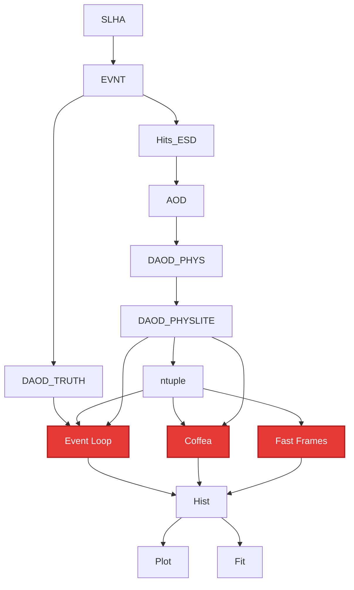

```mermaid
flowchart TD
    SLHA --> EVNT
    EVNT --> DAOD_TRUTH
    DAOD_TRUTH --> Event_Loop
    Event_Loop --> Hist

    EVNT--> Hits_ESD
    Hits_ESD --> AOD
    AOD --> DAOD_PHYS
    DAOD_PHYS --> DAOD_PHYSLITE

    ntuple --> Coffea
    Coffea --> Hist

    ntuple --> Fast_Frames
    Fast_Frames --> Hist

    ntuple --> Event_Loop
    DAOD_PHYSLITE --> Coffea
    DAOD_PHYSLITE --> ntuple
    DAOD_PHYSLITE --> Event_Loop

    Hist --> Plot
    Hist --> Fit

    click Event_Loop "https://github.com/usatlas/AF-Benchmarking/tree/main/event_loop" "Event Loop documentation"
    click Coffea "https://github.com/usatlas/AF-Benchmarking/tree/main/NTuple_Hist/coffea" "Coffea documentation"
    click Fast_Frames "https://github.com/usatlas/AF-Benchmarking/tree/main/NTuple_Hist/fastframes" "Fast Frames documentation"

    Event_Loop["Event Loop"]
    Fast_Frames["Fast Frames"]

    classDef method fill:#e53935,stroke:#b71c1c,stroke-width:2px,color:white;
    class Event_Loop,Coffea,Fast_Frames method;
```
