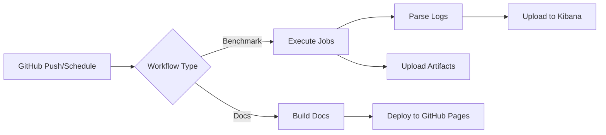

# CI/CD Workflows Overview

This project uses GitHub Actions to automate benchmark execution, parsing, and
documentation deployment.

## Available Workflows

The repository contains several automated workflows:

- **[UChicago Benchmarks](benchmarks.md)** - Runs benchmark jobs at the UChicago
  Analysis Facility every 6 hours
- **[Documentation](documentation.md)** - Builds and deploys documentation to
  GitHub Pages
- **Semantic PR Check** - Validates pull request titles follow conventional
  commit format

## Workflow Architecture



## Secrets Configuration

The workflows require these GitHub repository secrets:

| Secret          | Purpose                      | Used By          |
| --------------- | ---------------------------- | ---------------- |
| `VOMS_USERCERT` | VOMS user certificate        | Globus setup     |
| `VOMS_USERKEY`  | VOMS user key                | Globus setup     |
| `VOMS_PASSWORD` | VOMS password                | Globus setup     |
| `KIBANA_TOKEN`  | Kibana benchmark token       | Parse and upload |
| `KIBANA_KIND`   | Kibana benchmark kind        | Parse and upload |
| `KIBANA_URI`    | LogStash/Kibana URI endpoint | Parse and upload |

To add or update secrets:

1. Navigate to repository Settings → Secrets and variables → Actions
2. Click "New repository secret"
3. Add the secret name and value

## Pixi Environments

The project uses [pixi](https://pixi.sh) for dependency management with two
environments:

### `docs` Environment

**Python:** 3.14 **Purpose:** Building and serving documentation
**Dependencies:** mkdocs, plugins, linkchecker

```bash
pixi run -e docs build       # Build documentation
pixi run -e docs serve       # Serve with live reload
pixi run -e docs build-check # Build and validate links
```

### `kibana` Environment

**Python:** 3.13 **Purpose:** Parsing logs and uploading to Kibana
**Dependencies:** elasticsearch

```bash
pixi run -e kibana python parsing/scripts/...
```

## Quick Links

- [Benchmark Jobs Details](benchmarks.md)
- [Parsing and Kibana Integration](parsing.md)
- [Documentation Workflow](documentation.md)
- [Local Development Guide](development.md)
